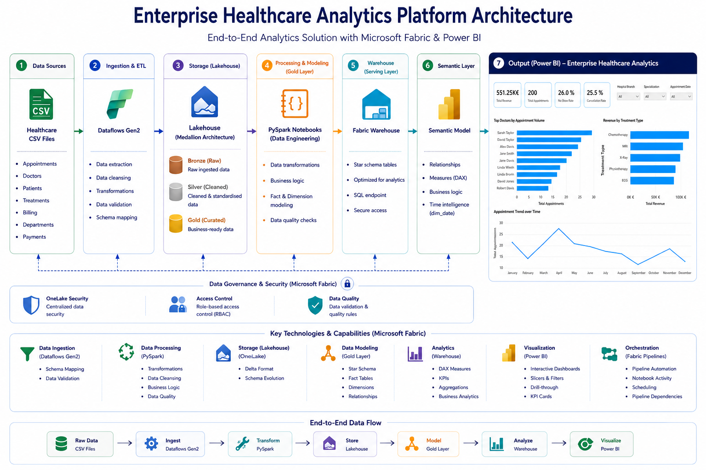
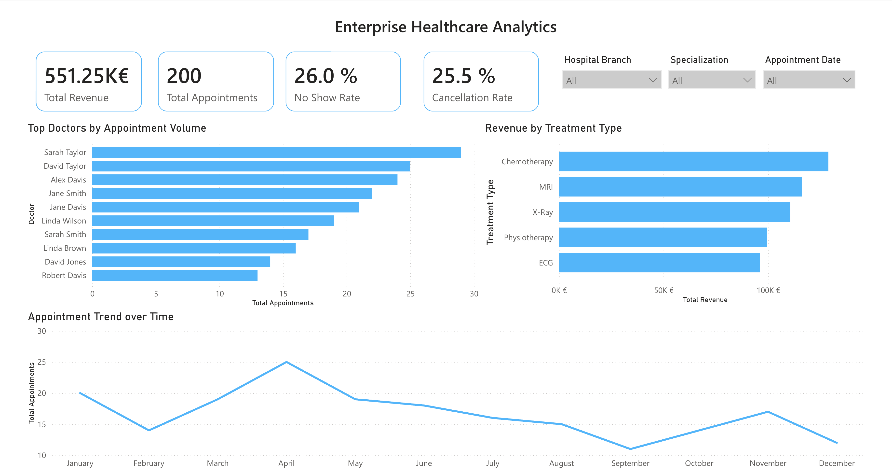
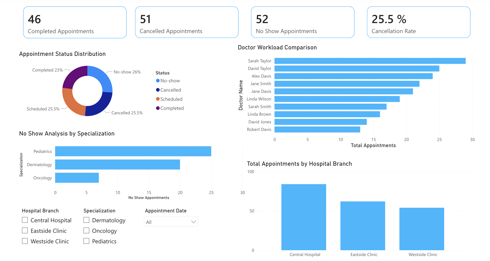
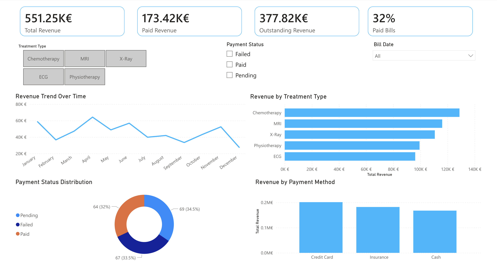

# Enterprise Healthcare Analytics Platform

Enterprise-grade end-to-end Healthcare Analytics Engineering project built using Microsoft Fabric, Power BI, PySpark, Lakehouse architecture, Fabric Warehouses, and modern Analytics Engineering principles.

This project simulates how a real-world healthcare analytics platform is designed, orchestrated, modeled, and visualized in enterprise environments using Microsoft Fabric.

---

# Project Overview

The goal of this project was to build a scalable healthcare analytics platform capable of transforming raw healthcare operational data into business-ready analytical insights through a modern Medallion Architecture approach.

The platform covers the complete analytics lifecycle:

- Raw healthcare data ingestion
- Data cleansing and transformation
- Lakehouse-based storage architecture
- Gold-layer business modeling
- Enterprise warehouse serving layer
- Semantic modeling
- Executive dashboard reporting
- Automated orchestration pipelines

The entire solution was designed to mimic enterprise analytics engineering workflows commonly used in modern cloud data platforms.

---

# End-to-End Architecture



---

# Core Architecture Components

## 1. Data Sources

Healthcare operational CSV datasets including:

- Appointments
- Patients
- Doctors
- Treatments
- Billing
- Payments
- Departments

---

## 2. Bronze Layer (Raw Data)

Raw source files are ingested directly into the Microsoft Fabric Lakehouse Bronze layer.

### Implemented Features

- Raw file ingestion
- Schema preservation
- Centralized OneLake storage
- Raw historical retention

---

## 3. Silver Layer (Transformation Layer)

The Silver layer was implemented using Microsoft Fabric Dataflows Gen2.

### Implemented Transformations

- Data cleansing
- Null handling
- Data standardization
- Schema alignment
- Data validation
- Business transformation logic

---

## 4. Gold Layer (Business Modeling)

Business-ready analytical tables were developed using PySpark notebooks inside Microsoft Fabric.

### Gold Layer Tables

### Dimension Tables

- `dim_patient`
- `dim_doctor`
- `dim_treatment`
- `dim_date`

### Fact Tables

- `fact_appointments`
- `fact_billing`

### Additional Business Models

- Doctor performance KPIs
- Revenue summary metrics
- Appointment analytics
- Payment analytics
- Cancellation and no-show analysis

---

# PySpark Engineering

PySpark notebooks were used for:

- Fact and dimension modeling
- Data transformation logic
- Business rule implementation
- KPI calculations
- Date dimension generation
- Warehouse-ready schema preparation

---

# Fabric Warehouse Layer

A dedicated Microsoft Fabric Warehouse was implemented as the serving layer for analytics consumption.

### Warehouse Features

- Star schema modeling
- SQL analytics endpoint
- Optimized analytical queries
- Centralized serving layer
- Secure analytical access

---

# Semantic Model & Power BI

A complete Power BI Semantic Model was built on top of the warehouse layer.

### Implemented Features

- Table relationships
- DAX measures
- KPI calculations
- Time intelligence logic
- Semantic business layer
- Interactive filtering
- Cross-visual interactions

### Example DAX Metrics

- Total Revenue
- Paid Revenue
- Outstanding Revenue
- Cancellation Rate
- No-show Rate
- Appointment Volume
- Doctor Workload
- Payment Analysis

---

# Dashboard Development

Three enterprise-style Power BI dashboard pages were developed.

---

## Executive Overview Dashboard



### Included Analytics

- KPI cards
- Appointment trends
- Revenue by treatment type
- Top doctors analysis
- Interactive slicers
- Department filtering

---

## Operational Analytics Dashboard



### Included Analytics

- Appointment status distribution
- Doctor workload comparison
- Hospital branch analysis
- No-show specialization analysis
- Operational KPIs

---

## Financial Analytics Dashboard



### Included Analytics

- Revenue trends
- Payment method analysis
- Payment status distribution
- Paid vs outstanding revenue
- Financial KPI monitoring

---

# Pipeline Orchestration

Microsoft Fabric Pipelines were implemented to automate the complete analytics workflow.

### Automated Activities

- Notebook execution
- Data movement
- Warehouse loading
- Dependency orchestration
- ETL scheduling
- End-to-end pipeline execution

---

# Enterprise Engineering Challenges Solved

One of the most valuable parts of this project was solving real-world enterprise data engineering problems.

### Problems Solved

- Delta schema mismatch handling
- Semantic model refresh failures
- Duplicate relationship key conflicts
- Warehouse synchronization issues
- Month sorting and time hierarchy problems
- Lakehouse-to-Warehouse dependency management
- Power BI relationship cardinality issues
- Notebook execution sequencing
- Schema overwrite handling in Delta tables
- Cross-layer orchestration consistency

---

# Technologies Used

## Microsoft Fabric Ecosystem

- Microsoft Fabric
- OneLake
- Lakehouse
- Fabric Warehouse
- Fabric Pipelines
- Dataflows Gen2
- Semantic Models

## Analytics & Engineering

- PySpark
- SQL
- DAX
- Power BI
- ETL / ELT
- Star Schema Modeling
- Medallion Architecture

---

# Enterprise Concepts Practiced

- Medallion Architecture
- Analytics Engineering
- Data Warehousing
- Semantic Modeling
- Star Schema Design
- Data Governance
- Data Quality Engineering
- Business Intelligence Reporting
- Enterprise ETL Pipelines
- End-to-End Analytics Workflows

---

# Future Improvements

Potential future enhancements:

- Incremental pipeline loading
- Real-time streaming ingestion
- Row-level security (RLS)
- CI/CD deployment workflows
- Fabric Git integration
- Advanced KPI forecasting
- Machine learning integration
- Real-time healthcare monitoring

---

# Repository Structure

```bash
enterprise-healthcare-analytics-platform/
│
├── architecture/
├── screenshots/
├── notebooks/
├── pipelines/
├── dataflows/
├── warehouse/
├── semantic-model/
└── README.md
```

---

# Author

## Emre BAKIR

LinkedIn:  
https://www.linkedin.com/in/emre-bakir

GitHub Repository:  
https://github.com/emrebkr/enterprise-healthcare-analytics-platform

